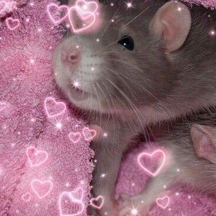
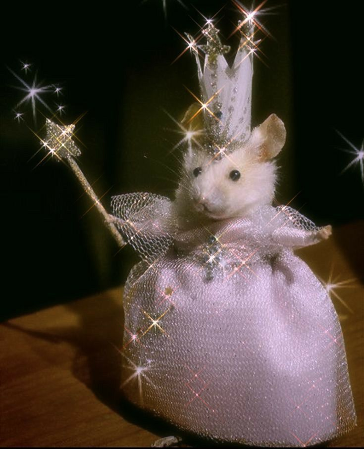

  <body bgcolor="#E0E4FB">
  <marquee behavior="scroll" direction="left" height="60" scrollamount="5">¡Hola!, Bienvenido a mi Git Hub. Desarrollado especialmente para la materia de: Programación. </marquee>  


<center>UP210694_CPP </center>

# Universidad Polítecnica de Aguascalientes  

<center>
  
<a title="Información sobre la UPA" href="https://upa.edu.mx/"></a>
</center>


## Maria Belen Salazar Delgado 

UP219694   
ISC03A  

<marquee behavior="scroll" bgcolor="#F9A6A6" direction="down" height="60" scrollamount="2"><center><font face=adler color="#000000" size=5><b> Unidades y Ejercicios en C++ </font> </center>
</marquee> 

 ## __U1__
<e1>
<li>01_Hola</li>
<li>02_Par Impar</li> 
<li>03_Tipos de datos</li>
<li>04_Ciclos</li>
<li>05_Edades</li> 
</e>
  
 ## __U1__ 
<e1>
<li>01_Rentas</li>
<li>02_Rendimiento</li> 
<li>03_SalaJuegos</li>
<li>04_Pizzería</li>
<li>05_Temperaturas</li> 
<li>05_Compras</li> 
<li>06_BinDec</li> 
</e>

</body>

<div hidden>
<center>  

# H1 Linea de encabezado
**Texto en Negritas**  
__Texto en negritas__  
*Texto en curiva*  

>Cita elementos  

---  

1. leer
1. Escribir
1. ejecutar
  
__  _
***  

<ol>
<li>Read</li>
<li>Write</li>  
<li>Exjecute</li>  
</center>

<FONT COLOR = "PURPLE">Acepta codigo HTML </FONT>  


* PRIMER ELEMENTO 
* SEGUNTO ELEMENTO
- TERCER ELEMENTO
  <br>

```
{
    char letra = 65; //letras= 'A'

    for (int i = 0; i < 26; i++)
    {
        cout << letra << "\t";
        letra = letra + 1;
        
    }
    return 0;
}  
``` 
  
  

<div align="center">


</div>  
  

## Tabla
| Color | Cofigo|
| ----- | ------- |
| Rojo  | #FF0000 |
| Azul  | #0000FF |  }

<br>


<center> <FONT>Mi tabla</fONT>
<table class="default">
  <tr>
    <th scope="row">YO: Belen Delgado</th>
    <th>Hobbies</th>
    <th>Metas</th>
    <th>Miedos</th>
  </tr>
  <tr>
    <th>Niñez</th>
    <td>Atletismo</td>
    <td>Estar en la ONU</td>
    <td>La obscuridad</td>
  </tr>
  <tr>
    <th>Ahora Mismo</th>
    <td>Escribir Poesia</td>
    <td>Lograr lo que creo que <br> para mi es imposoble</td>
    <td>Dejar de creer y de tener eperanza</td>
  </tr>
  <tr>
    <th>Un Futuro</th>
    <td>Probablemente descubra uno nuevo</td>
    <td>Lograr lo que creo que <br> para mi es imposoble,</td>
    <td>Dejar de creer y de tener eperanza</td>
  </tr>
</table>
</center>
 


`https://www.pinterest.com.mx/#bottom`
https://www.pinterest.com.mx/#bottom  
[ClickPreciosa](https://www.pinterest.com.mx/#bottom)  

> https://www.pinterest.com.mx/#bottom  
  
<https://www.pinterest.com.mx/#bottom> "Pinterest es la onda"

<a href= "https://www.pinterest.com.mx/#bottom"> Clic a la mejor pagina del mundo </a>
</div>
