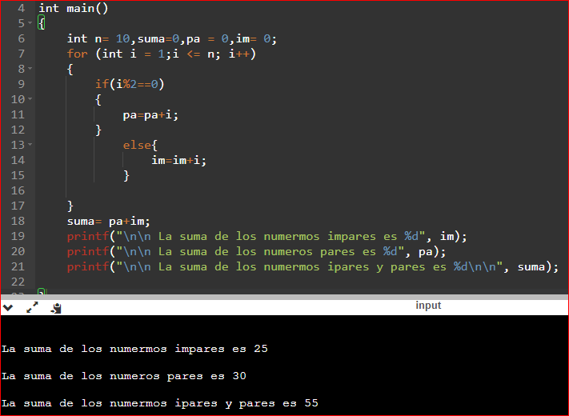

UP210694_CPP  

<b>María Belén Salazar Delgado<b>
 
  

## __U1__ 
 
<h2>Ejercicios:</h2>
<e1>
<li>01_Hola.cpp</li>
<li>02_ImparPar.cpp</li> 
<li>03_TiposDatos.cpp</li>
<li>04_Ciclo.cpp</li>
<li>05_Edades.cpp</li> 
</e>
  
   
<h2><b>01_Hola.cpp </b></h2>

Este codigo al ejecutarse  se muestra asi:

 
 Para observar el codigo completo:  

[Click here](https://github.com/UP210694/UP210694_CPP/blob/main/U1/01_Hola.cpp)   

 
<h2>02_ImparPar.cpp </h2>

Este codigo al ejecutarse  se muestra asi:

 
 Para observar el codigo completo:  

[Click here](https://github.com/UP210694/UP210694_CPP/blob/main/U1/02_ParImpar.cpp)  

 
<h2>03_TiposDatos.cpp </h2>

  
Este codigo al ejecutarse  se muestra asi:

 
 Para observar el codigo completo:  

[Click here](https://github.com/UP210694/UP210694_CPP/blob/main/U1/03_TiposdeDatos.cpp)   

 
<h2>04_Ciclo.cpp</h2>

   
 Este codigo al ejecutarse  se muestra asi:

 
 Para observar el codigo completo:  

[Click here](https://github.com/UP210694/UP210694_CPP/blob/main/U1/04_Ciclos.cpp)    

 
<h2>05_Edades.cpp</h2>

Este codigo tiene como al inicio de su ejecucionte pregunta tu edad y dependiendo de la edad ingresada mostrara si eres de laprimera edad, la segunda yla tercera. ademas de si pasas de estas te mostraran otros mensajes. 

__Primera edad:__  

 

__Segunda edad:__  

  

__Tercera edad:__  

 

__Edad Avanzada :__  

 

__Edad Inexistente:__  

 
 
Este codigo al ejecutarse  se muestra asi:

 
 Para observar el codigo completo:  

Para observar el codigo:  
[Click here](https://github.com/UP210694/UP210694_CPP/blob/main/U1/05_edades.cpp)  